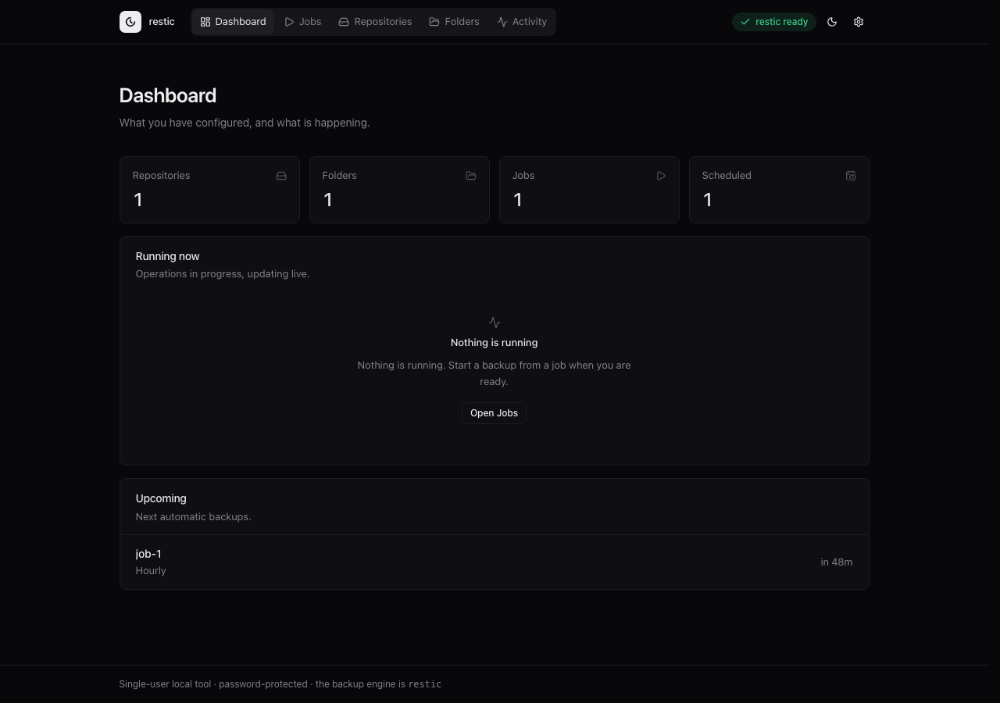
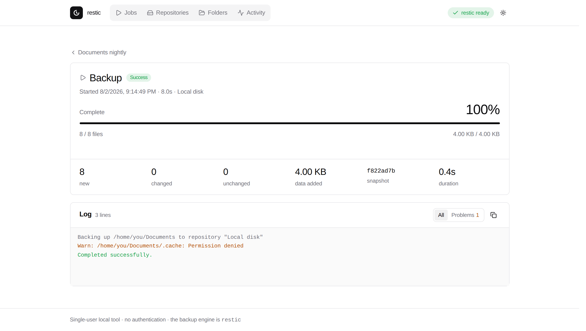
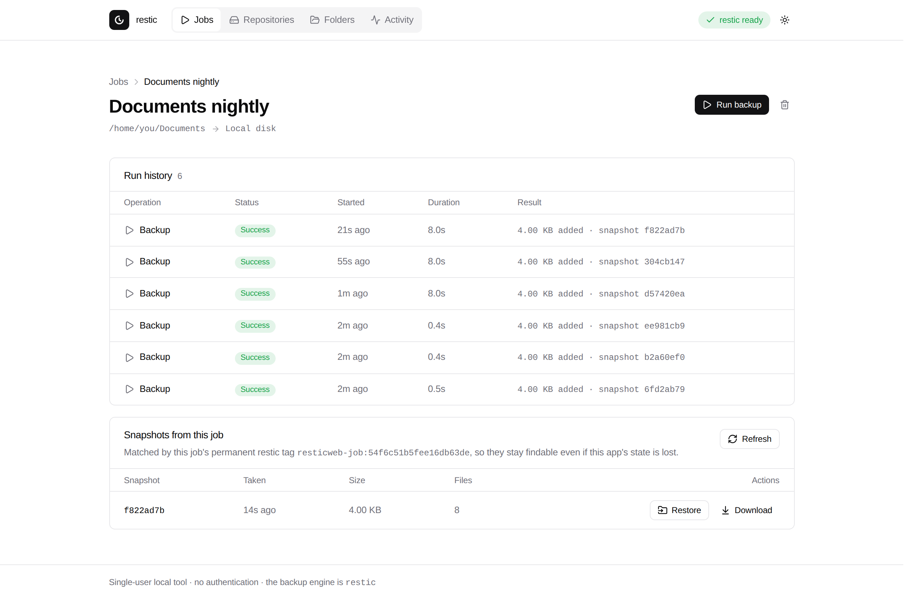
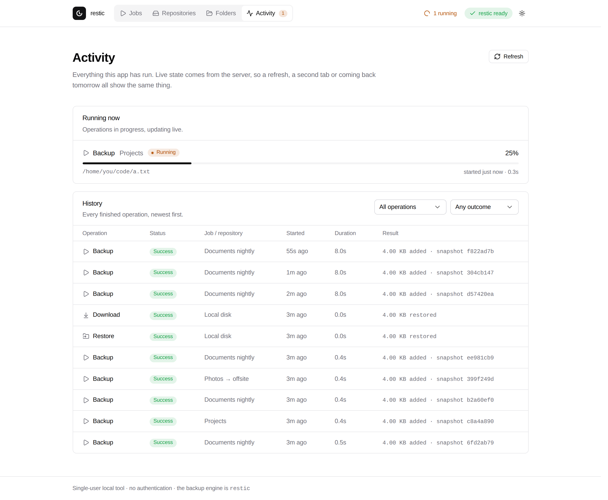

# restic backup manager

A **local web app** for managing [restic](https://restic.net)-based **incremental
backups**. The Go server wraps the `restic` command-line tool — restic does all
the real work (deduplication, chunking, encryption) — and serves a single-page UI
built around three things you create and manage:

- **Storage repositories** — several named places to store backups, added and
  edited in the app.
- **Backup folders** — named, reusable source folders.
- **Backup jobs** — the core concept: a saved, named pairing of one folder and
  one repository. A job is the thing you run, look at, and come back to.



Everything long-running — backups, restores, repository setup, and old-snapshot
restores/downloads — is a **run**: a durable record with its own live progress
and a permanent log. History survives restarts; a job in progress still shows as
running (with live progress and log) after a refresh, a second tab, or an hour
away; and if the app is killed mid-backup it never comes back claiming something
is still running.

This is a single-user tool meant to run on your own machine. On first open you
set a login password; afterwards the UI asks for it on each session, and you can
change it later from Settings.

---

## The interface

Dark is the default theme — the screenshots here are the light one, which you can
switch to from the top bar (there is also "follow system").

**Every run keeps its full log, forever.** Open a run from days ago and you get
the same view as one running now: progress, what it stored, and every line restic
printed. The log filters down to warnings and errors, copies to the clipboard, and
follows the tail only while you are already at the bottom — scrolling up to read
something is not fought by the next incoming line.



**A job owns its history.** Every run it has ever done, plus the snapshots it
created — matched by a permanent per-job restic tag, so they stay findable in the
repository even if this app's state is lost. Any snapshot can be restored to a
folder or downloaded as a zip.



**Activity is what is happening and what already happened.** Live progress for
anything in flight, then filterable history across every job and repository.



A few things worth knowing from the screenshots above:

- **Health is on the home screen.** The Dashboard summarises inventory, live
  runs, overdue schedules, and recent backup failures. Each job card still
  carries its last outcome, so "is anything broken?" is answered at a glance.
- **Contention is explained, not dead-ended.** Operations are serialized per
  repository; if one is in the way you get told which run holds it, with a link
  straight to it.
- **Colour means status.** The palette is otherwise monochrome, so green, amber
  and red on the page always refer to a run's outcome and nothing else.

---

## Prerequisites

1. **Go** 1.23 or newer — <https://go.dev/dl/>
2. **restic** on your `PATH`. The app detects when it is missing and shows a clear
   message. Install it with `brew install restic`, `apt install restic`,
   `dnf install restic`, `scoop install restic`, or a binary from
   <https://github.com/restic/restic/releases>. Verify with `restic version`.

## How to run

```sh
go run .
```

Then open the printed URL (default `http://127.0.0.1:8080`). On first open the
app asks you to choose a login password; later visits show the login page, and
you can change the password under Settings.

Flags:

```sh
go run . -addr 127.0.0.1:9000 -data ./data
```

- `-addr` — address to listen on.
- `-data` — directory for persisted state (default `./data`).
- `-config` — a legacy `config.json` to import once into a "Default" repository.

Build a standalone binary (the web UI is embedded):

```sh
go build -o restic-web . && ./restic-web
```

Node is **not** needed to build or run the app — only to change the interface.
See [Working on the UI](#working-on-the-ui).

## Quick start (Local backend — no credentials)

1. **Folders** → add a folder with the absolute path you want to back up.
2. **Repositories** → add a repository, backend **Local directory**, pick a
   directory (e.g. `./restic-repo`) and set a password.
3. **Jobs** → create a job pairing that folder and that repository.
4. **Run backup**. The repository is created and initialized on the first backup,
   so there is no separate setup step. Watch the live run; its history and
   snapshots appear on the job page.
5. Optionally enable **Automatic backup** on the job page (hourly, every N hours,
   daily, or weekly). Keep the process running — see
   [Running as a service](#running-as-a-service).
6. Change a file and run again to see an incremental backup (mostly *unchanged*,
   only a little *data added*).

A brand-new install walks you through steps 1–3 on the jobs screen rather than
showing an empty list.

For **S3**, add a repository with backend **S3-compatible** and fill in the
endpoint, bucket, optional region, access key, secret key, and password.
Credentials are always passed to restic through the process **environment**
(`RESTIC_PASSWORD`, `AWS_*`), never on the command line.

---

## Architecture

Dependency-free Go (standard library only); state is plain files under the data
directory. The front-end has its own toolchain, but it is a build-time concern —
the shipped binary is still a single self-contained executable.

```
data/
├── repositories.json        named storage locations   (atomic temp+rename, fsync)
├── folders.json             named source folders
├── jobs.json                folder + repository pairings
└── runs/<runId>/
    ├── run.json             the authoritative run record (status, progress, summary)
    └── log.jsonl            the append-only, permanent log
```

- **The durable run record is the single source of truth** for whether an
  operation is running. An in-memory handle exists only to stream output and to
  stop a run; it is never consulted to answer "is it running", so any browser,
  tab, or later visit reconstructs exact state from disk.
- **Per-repository serialization.** Two jobs targeting different repositories run
  in parallel; a second operation on a busy repository is refused with a clear
  message naming the blocker. (This is the app's policy — restic's backup/restore
  locks are non-exclusive — chosen for clarity and future prune/forget headroom.)
- **Crash honesty.** On startup, before serving, any run still marked running is
  reconciled to *interrupted*, and an orphaned restic child (identified via
  `/proc` on Linux) is reaped; affected repositories get a stale-only
  `restic unlock`.
- **Stop** sends restic `SIGINT` (clean: no partial snapshot, lock released) with
  a hard-kill fallback.
- **Live sync** is Server-Sent Events. A per-run stream replays the durable log
  backlog then tails live, resuming exactly via `Last-Event-ID`; a global stream
  drives list badges. Live delivery is a pure accelerator — the durable record is
  always the catch-up source.
- **Job ↔ snapshot** association is a stable per-job restic tag
  (`resticweb-job:<id>`), so a job's snapshots are discoverable from the
  repository itself.
- **Automatic backups.** A job may carry an optional schedule (hourly, every N
  hours, daily, or weekly). An in-process scheduler polls the wall clock and
  starts the same backup path as a manual run (`params.trigger=schedule`).
  Missed slots catch up once after downtime; a busy repository is skipped and
  retried on the next tick. The process must stay running for schedules to fire —
  see [Running as a service](#running-as-a-service).

### Code layout

```
main.go            entry point: flags, embedded UI, startup reconcile, HTTP server
model.go           domain types: Repository, Folder, Job, JobSchedule, Run, LogLine
store.go           generic entity file store (atomic, fsync'd) + typed errors
app.go             dependency container + legacy config import
runstore.go        durable run records + append-only logs + reconcile + retention
coordinator.go     per-repository locking; drives every run kind
scheduler.go       automatic-backup poller (wall-clock due / catch-up / busy skip)
runner.go          Runner interface + real restic runner (streaming) + exit codes
restic.go          stateless restic helpers (message/snapshot parsing, classification)
broadcaster.go     history-free SSE fan-out (the event bus)
reconcile.go       startup crash recovery + orphan reaping
server.go          routing + shared HTTP helpers
handlers_*.go      HTTP handlers: entities, runs, repo ops, SSE, status
sysproc_*.go       process-group setup / signalling (unix, windows)
reap_*.go          orphan identification (linux via /proc; no-op elsewhere)
ui/                UI source (React + Tailwind + shadcn/ui) — see below
web/               built UI, committed and embedded into the binary
```

### A note on the HTTP API

The UI talks to a plain JSON API, which is usable on its own:

| Endpoint | Notes |
| --- | --- |
| `GET /api/auth/status` | public; `{ setupRequired, authenticated }` for the login gate |
| `POST /api/auth/setup` | public once; sets the login password on first open and starts a session |
| `POST /api/auth/login` | public; `{ password }` → HttpOnly session cookie |
| `POST /api/auth/password` | change password (requires session) |
| `GET /api/jobs` | each job carries its `lastRun`, `runCount`, and schedule health (`nextDueAt`, `scheduleState`) |
| `POST /api/jobs/{id}/run` | `202` with the new run id, or `409` `busy` naming the blocking run |
| `GET /api/runs` | filter with `status` (`active`/`finished`/an exact status), `kind`, `jobId`, `limit`; `total` reports the match count before the limit |
| `GET /api/runs/{id}/log` | the durable log, `?after=<seq>` for incremental reads |
| `GET /api/runs/{id}/events` | SSE: run state, progress and log, resumable via `Last-Event-ID` |
| `GET /api/events` | SSE: run-level state changes across the app |
| `GET /api/repositories` | secrets are omitted; `hasPassword` / `hasSecretKey` report whether one is set |

Every other `/api/*` route requires the session cookie from setup or login.

## Working on the UI

The interface is a React single-page app built with [Vite](https://vite.dev),
[Tailwind CSS v4](https://tailwindcss.com) and
[shadcn/ui](https://ui.shadcn.com) components (Radix primitives, lucide icons).
Those components are *copied into* `ui/src/components/ui/` rather than installed
as a dependency, so they can be edited like any other file in the repo.

The source lives in `ui/`; its build output is committed to `web/`, which
`main.go` embeds. That keeps `go build` a single step for anyone who only wants
to run the app.

```sh
cd ui
npm install
npm run build     # writes ../web — commit the result alongside your source change
npm run dev       # hot-reloading dev server, proxying /api to localhost:8080
```

For `npm run dev`, run the Go server separately (`go run .`) so the proxy has an
API to talk to.

```
ui/src/
├── main.jsx             routes (hash-based, so old #/jobs/… links still work)
├── index.css            theme tokens for dark + light
├── routes/              one file per screen
├── components/          app components (shell, run history, log panel, …)
├── components/ui/       shadcn/ui primitives
└── lib/                 API client, SSE hooks, formatting, run vocabulary
```

The visual language is deliberately narrow: a neutral grey ramp for every
surface, no brand hue at all (the primary action colour is the foreground
itself), and colour reserved entirely for run status. Dark is the default; the
stored choice is applied before first paint, so the page never flashes.

## How it maps to restic

| Action          | Command run                                              |
| --------------- | ------------------------------------------------------- |
| Test connection | `restic -r <repo> cat config`                           |
| Initialize      | `restic -r <repo> init` (also run automatically by a backup against an uninitialized repository) |
| Backup          | `restic -r <repo> backup <src> --tag resticweb-job:<id> --json` |
| List snapshots  | `restic -r <repo> snapshots [--tag …] --json`           |
| Restore         | `restic -r <repo> restore <id> --target <dir> --json`   |
| Download (zip)  | restore into a temp workspace, then stream a zip        |
| Unlock          | `restic -r <repo> unlock` (removes only stale locks)    |

## Notes & limitations

- The **login password** is stored as a PBKDF2-SHA256 hash in `data/auth.json`
  (`0600`). Sessions are in-memory cookies — restarting the app means logging in
  again.
- Secrets (repository passwords, S3 secret keys) are stored **in plaintext** in
  the data directory (files are `0600`). Fine for a local single-user tool; not
  for shared or production use. They are read through a single choke point, so
  encrypting at rest later is a localized change. They are never sent to the
  browser: the API reports only whether a secret is set, and an edit that leaves
  a secret field blank keeps the stored value.
- Retention keeps the newest 100 runs per job on startup; download workspaces are
  ephemeral and wiped on startup. Snapshot retention (`forget` / `prune`) is not
  built in yet — automatic backups will grow the repository until you prune
  outside the app or that lands as a follow-up.
- A browser cannot hand the server a real local path, so source and target
  folders are entered as absolute-path text fields. A mistyped path surfaces as a
  failed run rather than as validation.
- restic must be the sole writer per repository for the stale-lock handling to be
  safe.
- Scheduled backups only fire while this process is running. Closing the browser
  is fine; quitting the binary is not.

## Running as a service

For automatic backups to fire overnight, keep `restic-web` running under the OS
service manager. Sample units live in `docs/systemd/` and `docs/launchd/` —
copy, edit the binary and data paths, then enable them.

**systemd (Linux):**

```sh
sudo cp docs/systemd/restic-web.service /etc/systemd/system/
# edit User=, ExecStart=, and WorkingDirectory=
sudo systemctl daemon-reload
sudo systemctl enable --now restic-web
```

**launchd (macOS):**

```sh
cp docs/launchd/com.resticweb.app.plist ~/Library/LaunchAgents/
# edit the ProgramArguments paths inside the plist
launchctl load ~/Library/LaunchAgents/com.resticweb.app.plist
```
