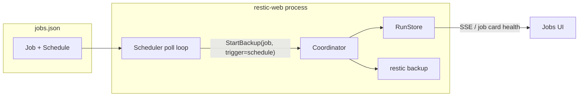

# Automatic backups

A schedule on the Job, fired by an in-process scheduler, executed as a normal
backup Run through the existing coordinator. Do not add a fourth user-facing
entity, and do not shell out to cron.

The app already has the hard parts. A job is “the thing you run.” A backup is
already a durable `Run` with logs, progress, crash recovery, and per-repository
locking. Automatic backups should reuse that path so a 2am backup looks exactly
like a click on **Run backup**, plus a `trigger` of `schedule`.

The README already states the gap: *“There is no scheduler: jobs run when you
run them.”*

---

## Why this shape

Three options exist. Only one fits this codebase.

| Approach | Verdict |
|---|---|
| **Schedule field on `Job` + in-process scheduler** | Right fit. One concept, one execution path, stdlib-only. |
| Separate Schedule entity | Extra CRUD for a 1:1 relation. Jobs already *are* the runnable unit. |
| systemd/cron calling `restic` or the HTTP API | Bypasses `Coordinator` (busy handling, auto-init, tags, SSE, reconcile). Also fights the “single self-contained binary, no dependencies” design. |

For production, wrap **this process** in launchd/systemd so it stays up. The OS
keeps the app alive; the app owns *when* and *how* restic runs.



---

## Data model

Add an optional schedule to `Job`. Existing `jobs.json` records stay valid:
missing `schedule` means off.

```go
type Job struct {
    Meta
    FolderID     string       `json:"folderId"`
    RepositoryID string       `json:"repositoryId"`
    Schedule     *JobSchedule `json:"schedule,omitempty"`
}

type JobSchedule struct {
    Enabled  bool   `json:"enabled"`
    Kind     string `json:"kind"`               // hourly | every | daily | weekly
    Every    string `json:"every,omitempty"`    // Kind=="every", Go duration: "6h"
    At       string `json:"at,omitempty"`       // "02:00" local time, daily/weekly
    Weekdays []int  `json:"weekdays,omitempty"` // 0=Sun … 6=Sat
}
```

**Presets, not cron.** This UI is built for a person, not a crontab. Suggested
kinds:

- **Hourly**
- **Every N hours** (4 / 6 / 12)
- **Daily at HH:MM**
- **Weekly on selected days at HH:MM**

Timezone is the machine’s local zone. This is a single-user app bound to
`127.0.0.1`; IANA-per-job is extra surface for no gain.

On each `jobView` (the jobs list already denormalizes `lastRun` / `runCount`),
add derived fields — do not persist them:

- `nextDueAt`
- `scheduleState`: `off` | `scheduled` | `running` | `overdue`
- `overdue` means: enabled, last **successful** backup is older than one
  period, and nothing is running

Health stays glanceable on the Dashboard (and on each job card), which is
already the product’s rule.

On the Run, record why it started:

```go
run.Params["trigger"] = "schedule" // or "manual"
```

First log line for a scheduled run: `Started by schedule (daily at 02:00).`

---

## Scheduler: a wall-clock poller, not a timer heap

Add `scheduler.go`, started from `main` **after** `app.Reconcile()` so
interrupted runs are honest before anything new is launched.

**Poll every ~15–30s against wall clock.** Do not use a long `time.Ticker` as
the source of truth. Laptops sleep; Go timers are monotonic and will not
“notice” 2am while the lid is closed. A short poll plus `time.Now()` in the
local zone is correct, testable, and fine for tens of jobs.

Inject the clock:

```go
type Scheduler struct {
    app  *App
    now  func() time.Time
    tick time.Duration
}
```

Each tick:

1. List jobs with `Schedule.Enabled`.
2. Skip if that job already has an active backup.
3. If `due(job, now)` → `coord.StartBackup(jobID)` with `trigger=schedule`.
4. If `BusyError` (another job holds the same repository): skip this tick, try
   again next tick. **Do not invent a Run for a skip.** A Run in this app is a
   restic execution, not a missed alarm.

That last point matters: the coordinator already serializes per repository and
returns a named blocker. The scheduler should treat busy as “try later,” not as
failure.

### When is a job due?

Two clocks, used for two different questions:

| Question | Use |
|---|---|
| Is the data protected? (overdue badge) | Last **successful** backup of this job, any trigger |
| May we fire again? (retry / cadence) | Last **terminal backup attempt** of this job |

That split avoids two failure modes:

- **Retry storm:** a failed S3 backup would otherwise re-fire every 15s.
- **False health:** a failed attempt would otherwise look like “we backed up
  20 minutes ago.”

Concrete rules:

**Interval** (`hourly` / `every 6h`): due when `now - lastAttempt >= period`.
Never-run → due on the first tick after enable (you turned automatic backups
on; do one).

**Calendar** (`daily` / `weekly`): due when we have crossed a fire time since
`lastAttempt`. Never-run → wait for the next `At` (enabling “daily at 02:00” at
3pm should not dump a backup immediately). **Catch-up:** if the process was
down across a fire time, `nextDueAt` is in the past → fire once on the next
tick. Never replay 48 missed hourlies after a weekend off.

**Manual run counts.** If you clicked **Run backup** 10 minutes ago, the
scheduled slot is satisfied. Cadence is “is there a recent backup,” not “did
the timer fire.”

**Failed last attempt:** do not wait a full day. Retry after `min(period, 1h)`
so a transient network blip on a daily job is retried within an hour, still at
most one run at a time.

On startup the same `due()` function runs — no special “startup job list.”
Catch-up falls out of the math.

---

## Execution path (keep it boring)

```
Scheduler tick
  → Coordinator.StartBackup(jobID)   // same function the HTTP handler uses
    → resolveJob
    → durable Run (kind=backup, params.trigger=schedule)
    → restic backup --tag resticweb-job:<id>
    → auto-init if exit 10
    → finalize + SSE
```

Do not add a second restic launcher. Auto-init, job tags, SIGINT stop, orphan
reaping, and the jobs-page live progress all keep working because the Run is
identical.

Change `StartBackup` to accept a trigger (or a small options struct) so HTTP
`POST /api/jobs/{id}/run` stays `manual`.

---

## UI

**Dashboard (home screen)**  
Needs-attention and overdue schedules surface here as a summary desk. Upcoming
schedules and recent backup failures deep-link into Jobs / Activity. Do not add
charts or a separate Schedules nav item.

**Job card**  
Schedule line under last-run: `Daily at 02:00 · next in 4h`, or amber
`Overdue · last success 2 days ago`. Running scheduled backups already show
live progress via SSE.

**Job detail**  
A “Automatic backup” card: enable/disable, preset, time, weekdays. Pause is
`enabled: false` — keep the rest of the config. Manual **Run backup** stays.

**New job dialog**  
Optional “Also run automatically,” default **off**. Automatic backups should
be a conscious choice.

The jobs list API already returns everything Dashboard and Jobs need in one
request. Keep that: compute `nextDueAt` / `scheduleState` in `viewWith`.

---

## Files

| File | Role |
|---|---|
| `model.go` | `JobSchedule`, `Job.Schedule`, validation |
| `scheduler.go` | poll loop, `due()`, catch-up |
| `scheduler_test.go` | fake clock table tests (the real test surface) |
| `coordinator.go` | `StartBackup` takes trigger; stamp `params.trigger` + log line |
| `app.go` / `main.go` | construct + start scheduler after reconcile |
| `handlers_entities.go` | validate schedule on create/update; derived view fields |
| `ui/src/routes/jobs.jsx` | next/overdue on the card |
| `ui/src/routes/job-detail.jsx` | schedule editor |
| `README.md` | replace “there is no scheduler”; document that the process must stay running |

Stay stdlib-only (`go.mod` has no deps). Do not add `robfig/cron`.

Tests that matter: due/not-due matrix, catch-up fires once, busy skip,
disabled job never fires, manual success postpones the next scheduled run,
failed run retries after 1h not 15s. Drive the scheduler with a fake `now` and
the existing fake `Runner`.

---

## What not to put in v1

These are real production needs, but they are different features:

1. **`forget` + `prune` retention.** Automatic backups without retention will
   grow the repository forever. Next feature after this: a keep-policy on the
   job (`last 7 / daily 30 / weekly 12 / monthly 12`) as a new `RunKind`, run
   after a successful backup. Do not mix it into the scheduler’s first cut —
   it is a destructive restic operation and needs its own run, log, and
   confirmation UX.
2. **Notifications / email / ntfy.** The overdue badge is enough for a
   localhost app.
3. **Cron expressions, multiple schedules per job, file-watch/continuous
   backup.**
4. **A fake “missed” Run.** History stays “things restic actually did.”

---

## Production companion: the process has to stay alive

The scheduler only runs while `restic-web` is running. Closing the browser is
fine; quitting the binary is not.

Ship (or document) a launchd plist / systemd unit that:

- starts the binary on boot
- restarts it on crash
- points `-data` at a stable directory
- keeps `-addr` on `127.0.0.1`

`GET /api/status` already exists for a watchdog.

Other production gaps **not** bundled into this feature: plaintext secrets in
`data/` (the README already flags this; there is a single choke point to
encrypt later). App login is password-gated (set on first open).

---

## Implementation order

1. Model + validation + `jobView` derived fields (API can describe a schedule
   before anything fires).
2. `due()` with a fake clock — write the tests first; this is the behavior.
3. Scheduler loop calling `StartBackup`; stamp `trigger`; busy = skip.
4. UI: job-detail editor, then job-card next/overdue.
5. README + a sample launchd/systemd unit.

### Defaults

1. **Presets only** (hourly / every N hours / daily / weekly) — no cron string.
2. **Catch-up on restart** — one run if a slot was missed while the app was
   down, never a backlog of N runs.
