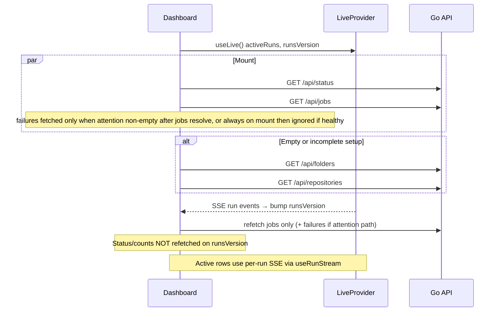

# Dashboard Page — Design Document

| Field | Value |
| --- | --- |
| **Author** | saeed |
| **Date** | 2026-08-26 |
| **Status** | Draft (revised after design review) |
| **Related** | Jobs (`ui/src/routes/jobs.jsx`), Activity (`ui/src/routes/activity.jsx`), `GET /api/status` (`handlers_status.go`), schedule UI notes in `docs/automatic-backups.md` |

---

## Overview

The restic backup manager already answers “is anything broken?” on the **Jobs** list (last outcome, live progress, schedule overdue) and “what ran?” on **Activity**. What it lacks is a single **glance page** that answers two questions at once: **what exists in the system** (repositories, folders, jobs, schedules) and **what is happening now** (active runs, recent failures, backup health).

This design adds a **Dashboard** route that composes existing APIs and UI patterns—no new domain concepts, and no heavy backend unless a thin status enrichment proves necessary. Dashboard becomes the new home (`/` → `/dashboard`); Jobs remains a first-class nav destination and the primary place to create and run backups.

---

## Background & Motivation

### Current state

- Default route today: `index: true` redirects to `/jobs` in [`ui/src/main.jsx`](ui/src/main.jsx). Brand and README call Jobs “the home screen.”
- Primary nav in [`ui/src/components/shell.jsx`](ui/src/components/shell.jsx): Jobs · Repositories · Folders · Activity. Shell comments still say “four sections.”
- Live state is already global via SSE: [`ui/src/lib/live.jsx`](ui/src/lib/live.jsx) + `GET /api/events` ([`handlers_sse.go`](handlers_sse.go)).
- `GET /api/status` ([`handlers_status.go`](handlers_status.go)) already returns:
  - `resticInstalled` / `resticVersion`
  - `counts: { repositories, folders, jobs }`
  - `activeRuns`
- The UI’s `LiveProvider` currently **discards** `counts` and only keeps restic fields.
- Job list enrichment (`jobView` in [`handlers_entities.go`](handlers_entities.go)) already ships `lastRun`, `runCount`, `nextDueAt`, `scheduleState` (`off` | `scheduled` | `running` | `overdue`)—enough to derive health client-side.
- **`lastRun` is any job-scoped run kind** (`RunStore.statsByJob` picks the newest run with that `jobId`, not backup-only). Schedule health correctly uses backup-only `backupTiming`. Job cards already display `lastRun` this way.
- Activity already implements live “Running now” rows (`ActiveRunRow`) and filterable history via `Runs.list({ status, kind, limit })`.
- Folders/Repositories open create dialogs from `location.state.create`; **Jobs does not** today—GettingStarted step 3 calls `onNewJob` which only works inside the Jobs route.
- [`docs/automatic-backups.md`](docs/automatic-backups.md) currently says “Stay on the existing surfaces. **No new primary nav item.**” and ties health to the Jobs home screen—stale once Dashboard lands.

### Pain points

1. **Inventory is invisible** until you open each section. A user with three jobs and zero folders misconfiguration is hard to see from Activity.
2. **Cross-cutting health** (any failed last run, any overdue schedule, anything running) requires scanning the full Jobs list or Activity filters.
3. **First open / return visit** has no “summary desk”—Jobs is excellent for *doing* work, weaker as a *status* overview when the list grows.
4. Product language already wants glanceable health (“is anything broken?”) without implying a flashy SaaS metrics wall.

### Why now

Schedules (`docs/automatic-backups.md`) increase the value of an overdue / next-due summary. As jobs accumulate, a composed dashboard becomes the cheapest way to keep the “glanceable health” promise without bloating every list page.

---

## Goals & Non-Goals

### Goals

1. Ship a **Dashboard** page that is **functional, concise**, and visually consistent with existing `Page` / `Card` / `StatusBadge` / empty-state patterns.
2. Summarize **inventory**: counts of repositories, folders, jobs; count of jobs with schedules enabled; optional “next due” peek.
3. Summarize **activity & health**: active runs (live), jobs needing attention (failed / interrupted last run, overdue schedule), recent failed **backup** runs.
4. Reuse existing APIs and components; prefer client composition over new endpoints.
5. Make Dashboard the **default landing route** after login, with a clear justification vs keeping Jobs as home.
6. Preserve Jobs as the place to **create / run** backups. **End state:** Dashboard owns GettingStarted for empty installs; Jobs keeps a compact empty state. **During PR 3** (Jobs still home), Jobs retains GettingStarted so `/` onboarding does not regress before the PR 4 home flip (see Key Decisions).
7. Incremental, independently reviewable PRs with hard extract dependencies before the feature PR.

### Non-Goals

- Charts, sparklines, heatmaps, or time-series analytics.
- Snapshot inventory across repositories (restic `snapshots` is slow / remote; keep that on job/repo detail).
- New auth, multi-user, or role concepts.
- Aggregated storage usage / dedup savings (would need restic stats commands not wrapped today).
- Replacing Activity or Jobs; Dashboard links into them.
- Push notifications or email alerts.
- Changing per-repository serialization or run durability semantics.
- Mounting `NewJobDialog` on Dashboard (creation stays on Jobs via router state).

---

## Key Decisions

| Decision | Choice | Rationale |
| --- | --- | --- |
| **Home route** | Dashboard becomes `/` (redirect `/` → `/dashboard`); Jobs stays in nav | Jobs remains the action surface; Dashboard is the status desk. README’s “health on the home screen” moves with the home route. Brand logo links to Dashboard (in the flip PR). |
| **Nav placement** | First tab: Dashboard (lucide `LayoutDashboard`), then Jobs, Repositories, Folders, Activity | Status desk first. Activity keeps its live count badge. Update shell “four sections” comment to five. Visual QA at ~1024–1200px before merge (inline `lg` nav has no horizontal scroll). |
| **Data source (v1)** | Compose `Status.get`, `Jobs.list`, `Runs.list({ status, kind: "backup", limit })`, plus `useLive().activeRuns` | Avoids a new aggregate endpoint; all data already exists. |
| **Backend change (optional, later)** | Thin enrichment of `GET /api/status` with health rollups only if client fan-out proves chatty | Single-user local app; a few GETs on mount is fine. Defer until measured pain. |
| **Getting Started ownership** | **End state (PR 4+):** Dashboard owns the full wizard when `jobs.length === 0`. **PR 3 window:** Jobs **keeps** GettingStarted while `/` still lands on Jobs; Dashboard **also** renders it so `/dashboard` is usable. PR 4 removes GettingStarted from Jobs when the home flip lands | Avoids onboarding regression on the live home route between PR 3 and PR 4. |
| **Create-job from GettingStarted** | Step 3 is a conditional CTA (disabled `Button` until prerequisites; `Link` button when ready) to `/jobs` with `state={{ create: true }}`. Jobs opens `NewJobDialog` via effect + clear state (inspired by Folders/Repositories, not a copy of their mount-only initializer). Dashboard does **not** mount `NewJobDialog` | Keeps job creation on the Jobs action surface; same-route open works while GettingStarted still lives on Jobs in PR 2–3. |
| **Jobs empty state** | **PR 3:** keep GettingStarted (home still Jobs). **PR 4+:** compact `EmptyState` only—no wizard duplicate. If folders+repos exist: “No jobs yet” + **Create job**. Else: short copy + link **“Finish setup on the Dashboard”** → `/dashboard` | One wizard on the actual home route at every merge; after the flip, Jobs stays useful mid-setup without duplicating the full guide. |
| **PR 3 → PR 4 onboarding** | Option (a): **defer** moving GettingStarted off Jobs until PR 4. Do not ship a release that has Dashboard-only GettingStarted while `/` → `/jobs` | Protects brand-new installs on the default route. |
| **Live updates** | Split loaders: refetch **jobs + recent failures** on `runsVersion`; fetch **status/counts** on mount (and after entity create flows / focus return)—**not** on every SSE tick | Matches Jobs (refetch jobs only). Counts almost never change on run progress. |
| **Inventory count source** | Prefer `jobs.length` and **`scheduledTotal`** (`jobs.filter(j => j.schedule?.enabled).length`) when jobs are loaded—not `selectUpcoming(...).length`. Use `Status.get` counts for repos/folders (and for jobs while the jobs list is still loading) | Avoids under-count when >5 schedules; status remains the cheap path when lists are skipped. |
| **Colour** | Status colours only (`success` / `warning` / `destructive`); inventory tiles stay monochrome | Matches [`ui/src/index.css`](ui/src/index.css) design language. |
| **Snapshots on dashboard** | Out of scope | Expensive; already on job/repo detail via `SnapshotsPanel`. |
| **Run backup from dashboard** | No primary “Run” CTAs on every job; deep-link to Jobs / job detail | Keeps Dashboard concise; avoids duplicating `JobCard` action chrome. |
| **Needs-attention signal** | Parity with `JobCard`: use `lastRun` **any kind** for failed/interrupted; plus `scheduleState === "overdue"`. Copy says **“last run”**, not “last backup” | `statsByJob` is kind-agnostic; overclaiming “backup” would lie when the latest op was restore/download. |
| **Recent failures scope** | `kind: "backup"` on both `failed` and `interrupted` list calls | Dashboard frames **backup health**; Activity remains the cross-kind history. |
| **Health banner (MVP)** | **In for MVP** for failed-last-run and overdue counts only. **Out:** activeRuns banner (Running card is enough). **Out:** duplicate restic-missing (shell `ResticBanner`). **Out:** permanent “all clear” hero | Colour only when something is wrong; silence = healthy. |
| **`success_warnings` in attention** | **No** | Warnings stay visible on Jobs; don’t inflate “broken.” |
| **`canceled` in attention / recent failures** | **No** | User-initiated stop is not “broken.” |
| **Nav label** | **“Dashboard”** (not “Home”) | Avoids ambiguity with former Jobs-as-home. |
| **Scheduled inventory tile link** | `/jobs` only | Jobs has no schedule section or hash anchor; no fake deep-link. |
| **Page composition** | Fixed matrix (empty / healthy / attention)—see Proposed Design | Removes “above or instead of” ambiguity. |
| **PR 3 nav timing** | In PR 3 (Jobs still home): add Dashboard route + nav item **after Jobs** (not first). Brand + `/` stay on Jobs. PR 4 flips order, Brand, and `/` together | Avoids half-migrated IA during QA. |
| **PR extract dependencies** | PR 1 and PR 2 are **hard** dependencies of PR 3 (or stacked commits at the start of PR 3—not “inline forever”) | Preserves independently reviewable extracts. |

---

## Proposed Design

### Information architecture

```mermaid
flowchart TB
  subgraph Shell
    Nav[NavTabs: Dashboard · Jobs · Repos · Folders · Activity]
  end
  Dash[Dashboard /dashboard]
  Nav --> Dash
  Dash --> Inv[Inventory counts]
  Dash --> Happening[Running now]
  Dash --> Attention[Needs attention]
  Dash --> Recent[Recent backup failures]
  Dash --> Schedule[Upcoming schedules]
  Inv -->|Link| Jobs[/jobs]
  Inv -->|Link| Repos[/repositories]
  Inv -->|Link| Folders[/folders]
  Happening -->|/runs/:id| RunView
  Happening -->|See all| Activity[/activity]
  Attention -->|/jobs/:id| JobDetail
  Recent -->|/runs/:id| RunView
  Dash -->|GettingStarted step 3| JobsCreate["/jobs state.create"]
```

### Page composition matrix

| State | Criteria | Sections shown (in order) |
| --- | --- | --- |
| **Empty install** | `jobs.length === 0` | Inventory → GettingStarted → Running (compact empty OK) |
| **Healthy populated** | `jobs.length > 0`, attention set empty | Inventory → Running → Upcoming (only if any scheduled) |
| **Needs attention** | attention set non-empty | Inventory → Health banner → Running → Needs attention → Recent backup failures → Upcoming (if any) |

Rules:

- **Never** show Attention, Recent failures, or Upcoming on the empty-install path.
- **Omit** Recent failures when the merged backup failure list is empty (healthy silence—no muted “No recent failures” line).
- **Omit** Attention card when the attention set is empty.
- **Omit** Upcoming when no job has `schedule.enabled`.
- Running now **always** renders (including empty compact state).

### Page layout (top → bottom)

Use [`Page`](ui/src/components/page.jsx) + [`PageHeader`](ui/src/components/page.jsx):

- **Title:** `Dashboard`
- **Description:** One short line, e.g. “What you have configured, and what is happening.”
- **Actions:** none by default. On loader failure, show a compact inline error with Retry (see Observability)—not a permanent Refresh chrome.

#### 1. Inventory strip

Four compact, equal-width link cards (or a single `Card` with a 2×2 / 4-column grid):

| Tile | Value | Link |
| --- | --- | --- |
| Repositories | `status.counts.repositories` | `/repositories` |
| Folders | `status.counts.folders` | `/folders` |
| Jobs | `jobs.length` once jobs loaded; else `status.counts.jobs` | `/jobs` |
| Scheduled | `scheduledTotal` = count of **all** loaded jobs with `schedule.enabled` (not the Upcoming card’s ≤5 cap); `0` while jobs loading | `/jobs` |

Visual: monochrome; large tabular number (`text-2xl` / `display`), muted label underneath (`text-[13px] text-muted-foreground`). Hover: `hover:border-input` like [`JobCard`](ui/src/routes/jobs.jsx). No coloured backgrounds.

Empty install: tiles show `0` and still link (folders/repos create dialogs already open via `location.state.create`).

#### 2. Health summary (conditional; MVP)

A single slim banner **only in the Needs-attention state**—not a permanent green “all good” hero.

| Condition | Severity | Copy sketch | Link |
| --- | --- | --- | --- |
| `!resticInstalled` | — | Shell `ResticBanner` only—**do not duplicate** | — |
| Any attention job with failed/interrupted `lastRun` | destructive | “N job(s) need attention after their last run” | in-page Attention |
| Any job `scheduleState === "overdue"` (and no failed-last-run line, or combined) | warning | “N scheduled backup(s) overdue” | in-page Attention |
| `activeRuns.length > 0` | — | **No banner**—Running section covers it | — |

Combine into one banner when both failed and overdue apply (e.g. two short clauses). If attention is empty: **omit** the banner.

#### 3. Running now

Reuse Activity’s pattern ([`ActiveRunRow`](ui/src/routes/activity.jsx)):

- Data: `useLive().activeRuns` (already seeded by SSE snapshot).
- Each row: `useRunStream(id, { withLog: false })`, `Progress`, `StatusBadge`, `RunKindCell`, link to `/runs/:id`.
- Empty: compact `EmptyState` (“Nothing is running”)—shorter than Activity’s, with CTA link to `/jobs`.
- Footer link: “Open Activity →” when `activeRuns.length > 0`.

**Implementation note:** Extract `ActiveRunRow` + `ActiveRunsCard` into `ui/src/components/active-runs.jsx` so Activity and Dashboard share one implementation (PR 1).

#### 4. Needs attention

Shown only when the attention set is non-empty (see composition matrix).

A job is in the attention set if **any** of:

1. `lastRun.status` ∈ `{ failed, interrupted }` — **any `lastRun.kind`** (parity with `JobCard` / `statsByJob`).
2. `scheduleState === "overdue"`.

Explicitly **excluded:** `canceled`, `success_warnings`.

Each row:

- Job name → `/jobs/:id`
- `StatusBadge` for last run **or** warning text “Overdue”
- One line of context: `Last run {fmtRelative} · {error or summary}` / schedule title
- No Run button (link through)

Cap at **5** rows; “View all jobs →” if more. Sort: failed/interrupted first, then overdue, then by `lastRun.startedAt` ascending (oldest pain first).

#### 5. Recent backup failures

Shown only in the Needs-attention state **and** when the merged list is non-empty.

Two parallel calls (API is single `status=`):

```js
Runs.list({ status: "failed", kind: "backup", limit: 5 })
Runs.list({ status: "interrupted", kind: "backup", limit: 5 })
```

Merge/sort by `startedAt` desc, take 5. Render with [`RunHistory`](ui/src/components/run-history.jsx) (`showContext`).

Footer: plain link to `/activity` (query deep-links deferred to optional PR 5).

#### 6. Upcoming schedules

From `Jobs.list`, filter `schedule?.enabled`, sort by `nextDueAt` ascending (nulls last). Show up to **5**.

Row: job name, `describeScheduleTitle(schedule)`, `next {fmtRelative(nextDueAt)}` or warning overdue. Link `/jobs/:id`.

Omit card if zero scheduled jobs (including on empty install).

#### 7. Empty / first-run (GettingStarted)

When `jobs.length === 0`:

1. Extract `GettingStarted` to `ui/src/components/getting-started.jsx` (PR 2).
2. Change step 3 from `onNewJob` to a **conditional** CTA so a disabled control cannot navigate (Radix `asChild` + `disabled` on `Link`/`<a>` is not reliable):

```jsx
{hasFolder && hasRepo ? (
  <Button size="sm" variant="outline" asChild>
    <Link to="/jobs" state={{ create: true }}>Create a job</Link>
  </Button>
) : (
  <Button size="sm" disabled>
    Create a job
  </Button>
)}
```

3. In `ui/src/routes/jobs.jsx`, open the create dialog from router state. **Do not** copy Folders/Repositories’ mount-only `useState({ open: Boolean(location.state?.create) })` — that misses same-route opens while GettingStarted still lives on Jobs. Use an effect and **clear** state after open:

```jsx
const location = useLocation();
const [dialogOpen, setDialogOpen] = useState(false);
useEffect(() => {
  if (location.state?.create) {
    setDialogOpen(true);
    navigate(location.pathname, { replace: true, state: {} });
  }
}, [location.state, location.pathname, navigate]);
```

4. **Jobs empty UI by PR:**
   - **PR 2–3** (Jobs still home): keep rendering `GettingStarted` on Jobs so `/` onboarding does not regress.
   - **PR 3 also:** render `GettingStarted` on Dashboard (shared component).
   - **PR 4+** (Dashboard is home): remove GettingStarted from Jobs; Jobs uses compact `EmptyState` per Key Decisions.

### Routing & shell changes

[`ui/src/main.jsx`](ui/src/main.jsx) after PR 4:

```jsx
{ index: true, element: <Navigate to="/dashboard" replace /> },
{ path: "dashboard", element: <Dashboard /> },
{ path: "jobs", element: <Jobs /> },
// ...unchanged
```

[`ui/src/components/shell.jsx`](ui/src/components/shell.jsx) after PR 4:

```jsx
const NAV = [
  { to: "/dashboard", label: "Dashboard", icon: LayoutDashboard },
  { to: "/jobs", label: "Jobs", icon: Play },
  { to: "/repositories", label: "Repositories", icon: HardDrive },
  { to: "/folders", label: "Folders", icon: FolderOpen },
  { to: "/activity", label: "Activity", icon: Activity },
];
```

- Update `NavTabs` comment from “four sections” → “primary sections.”
- `Brand` `Link` `to="/dashboard"` (flip in PR 4 only).
- Narrow screens: existing horizontal scroll on the second header row.
- **Desktop (`lg+`) risk:** five labeled tabs share the sticky bar with Brand + ActivityIndicator + restic chip + theme + settings **without** scroll. **Acceptance:** visual QA at ~1024px and ~1280px widths; if cramped, enable overflow scroll on the desktop nav cluster too (same `overflow-x-auto` pattern). Do not shorten “Dashboard” unless QA forces it.

**PR 3 temporary IA** (Jobs still home):

```jsx
const NAV = [
  { to: "/jobs", label: "Jobs", icon: Play },
  { to: "/dashboard", label: "Dashboard", icon: LayoutDashboard },
  // …repositories, folders, activity
];
// Brand → /jobs; index → /jobs
```

### Data loading sequence



**Split loaders (required):**

1. **`loadStatus`** — `Status.get()` on mount; refresh when the user creates/deletes entities from flows that return to Dashboard, or on window focus if cheap. **Do not** tie to `runsVersion`.
2. **`loadJobs`** — `Jobs.list()` (+ folders/repos when setup incomplete). Refetch on `runsVersion > 0`.
3. **`loadRecentFailures`** — the two backup failure list calls. Refetch on `runsVersion`. May be skipped while `jobs.length === 0`, or always fetched but not rendered until the attention state (skipping is preferred to avoid wasted work on empty/healthy installs). Practical rule: fetch failures when `selectAttention(jobs)` is non-empty after jobs load, and refetch with jobs on `runsVersion` while attention remains possible (simplest correct approach: refetch jobs always; refetch failures only if previous attention was non-empty **or** any job’s new `lastRun` looks failed—implementers may simply refetch failures whenever jobs refetch if code simplicity wins; cost is two tiny local GETs).

**Mount cost:** a few JSON GETs, all local file-backed. No restic subprocess on dashboard load.

**`LiveProvider`:** keep page-local `Status.get` in v1; do not widen LiveProvider’s contract yet (optional PR 5).

### Component sketch

New file: `ui/src/routes/dashboard.jsx`

```jsx
// Pseudocode — matches the composition matrix
export default function Dashboard() {
  const { activeRuns, runsVersion } = useLive();
  const { data: statusData, reload: reloadStatus } = useFetch(loadStatus);
  const { data, loading, error, reload: reloadJobs } = useFetch(loadJobsAndMaybeFailures);

  useEffect(() => {
    if (runsVersion > 0) reloadJobs(); // not reloadStatus
  }, [runsVersion, reloadJobs]);

  useEffect(() => {
    document.title = "Dashboard · restic backup manager";
  }, []);

  const jobs = data?.jobs ?? [];
  const attention = useMemo(() => selectAttention(jobs), [jobs]);
  const upcoming = useMemo(() => selectUpcoming(jobs), [jobs]); // ≤5 for the card
  const scheduledTotal = useMemo(
    () => jobs.filter((j) => j.schedule?.enabled).length,
    [jobs],
  ); // full count for Inventory — not upcoming.length
  const empty = jobs.length === 0;
  const needsAttention = attention.length > 0;

  return (
    <Page>
      <PageHeader title="Dashboard" description="…" />
      {error ? <InlineLoadError onRetry={reloadJobs} /> : null}
      <InventoryStrip
        repoCount={statusData?.counts?.repositories ?? 0}
        folderCount={statusData?.counts?.folders ?? 0}
        jobCount={loading && !data ? statusData?.counts?.jobs ?? 0 : jobs.length}
        scheduledCount={scheduledTotal}
      />
      {empty ? (
        <GettingStarted
          hasFolder={(data?.folders?.length ?? statusData?.counts?.folders) > 0}
          hasRepo={(data?.repositories?.length ?? statusData?.counts?.repositories) > 0}
        />
      ) : null}
      {/* Order matches composition matrix: banner under Inventory, then Running */}
      {!empty && needsAttention ? <HealthBanner attention={attention} /> : null}
      <ActiveRunsCard runs={activeRuns} />
      {!empty && needsAttention ? <AttentionCard jobs={attention} /> : null}
      {!empty && needsAttention && data?.recentFailures?.length ? (
        <RecentFailuresCard runs={data.recentFailures} />
      ) : null}
      {!empty && upcoming.length ? <UpcomingCard jobs={upcoming} /> : null}
    </Page>
  );
}
```

Helpers (`selectAttention`, `selectUpcoming`) live in the route file initially.

### Wireframe (textual)

**Needs-attention (populated):**

```
┌─ Dashboard ─────────────────────────────────────────┐
│ What you have configured, and what is happening.    │
├──────────┬──────────┬──────────┬────────────────────┤
│  2       │  3       │  3       │  2                 │
│  Repos   │  Folders │  Jobs    │  Scheduled         │
├──────────┴──────────┴──────────┴────────────────────┤
│ 2 jobs need attention after their last run          │
├─────────────────────────────────────────────────────┤
│ Running now                              Activity → │
│ ▸ Backup  Documents → Disk  Running  42% ████░░     │
├─────────────────────────────────────────────────────┤
│ Needs attention                                     │
│ Photos → Offsite   Failed    2d ago · path not…     │
│ Mail → Disk        Overdue   Daily at 02:00         │
├─────────────────────────────────────────────────────┤
│ Recent backup failures                              │
│ (RunHistory table, ≤5 rows, kind=backup)            │
├─────────────────────────────────────────────────────┤
│ Upcoming                                            │
│ Documents → Disk   Daily at 02:00   in 5h           │
└─────────────────────────────────────────────────────┘
```

**Empty install:**

```
┌─ Dashboard ─────────────────────────────────────────┐
│ Inventory zeros → GettingStarted → Running (empty)  │
│ (no Attention / Recent / Upcoming)                  │
└─────────────────────────────────────────────────────┘
```

**Healthy populated:**

```
┌─ Dashboard ─────────────────────────────────────────┐
│ Inventory → Running → Upcoming (if scheduled)       │
│ (no banner, Attention, or Recent failures)          │
└─────────────────────────────────────────────────────┘
```

---

## API / Interface Changes

### v1 — no new endpoints (recommended)

| Existing API | Dashboard use |
| --- | --- |
| `GET /api/status` | `counts` on mount; restic fields already in shell via LiveProvider |
| `GET /api/jobs` | attention, schedules, job count; refetch on `runsVersion` |
| `GET /api/folders`, `GET /api/repositories` | only when setup incomplete (`jobs`/`folders`/`repos` counts suggest GettingStarted needs lists) |
| `GET /api/runs?status=failed&kind=backup&limit=5` | recent backup failures |
| `GET /api/runs?status=interrupted&kind=backup&limit=5` | merge into recent backup failures |
| SSE `/api/events` + `/api/runs/:id/events` | active runs / progress (unchanged) |

**Jobs route API/UI contract change (small):** honor `location.state.create` to open `NewJobDialog` (no backend change).

### v2 — optional `GET /api/status` enrichment (only if needed)

```go
// Additive fields on handleStatus — backward compatible
"counts": { "repositories", "folders", "jobs", "scheduledJobs" },
"health": {
  "failedLastRun": 2,
  "overdueSchedules": 1,
  "activeRuns": 1,
},
```

Pros: one round-trip for the strip + banner. Cons: duplicates logic already in `jobView` / `deriveScheduleState`; keep client-derived in v1.

### Frontend API client

No change required to [`ui/src/lib/api.js`](ui/src/lib/api.js); pass `kind: "backup"` through existing `Runs.list` params.

---

## Data Model Changes

**None.** Dashboard is a read-only composition of:

- Entity stores: `repositories.json`, `folders.json`, `jobs.json`
- Run store: `data/runs/*/run.json`
- Derived schedule fields already computed in `viewWith` / `attachScheduleView`

No migrations, no new files under `data/`.

---

## Alternatives Considered

### A. Keep Jobs as home; add Dashboard as a fifth nav item only

- **Pros:** Zero change to README mental model; bookmarks to `#/` → jobs unchanged in spirit.
- **Cons:** Two “overview” surfaces compete; new users still land on a list that mixes actions + health; inventory remains buried.
- **Rejected** as the primary UX: the product ask is a summary desk. Redirect `#/` to dashboard; `#/jobs` bookmarks keep working.

### B. New dedicated `GET /api/dashboard` aggregate

- **Pros:** One request; server can optimize joins.
- **Cons:** New handler + tests + response schema for a single-user app where existing list endpoints are already denormalized; harder to evolve UI independently.
- **Deferred** to v2 only if profiling shows need.

### C. Expand Jobs page with inventory header instead of a new route

- **Pros:** No nav growth.
- **Cons:** Jobs page becomes long and dual-purpose; Activity already owns “what happened”; README screenshots and GettingStarted coupling get messier.
- **Rejected**—separation of **status desk** vs **run backups** is clearer.

### D. Dashboard widgets that call restic (snapshot counts, repo size)

- **Pros:** Richer “what’s in the system.”
- **Cons:** Latency, credentials, locks; violates “compose existing APIs”; conflicts with per-repo serialization if a backup is running.
- **Rejected** for v1/v2 near-term.

### E. Mount `NewJobDialog` on Dashboard

- **Pros:** Create-job without leaving Dashboard.
- **Cons:** Duplicates Jobs’ dialog wiring and folder/repo option loading on the status desk; fights “Jobs is the action surface.”
- **Rejected** in favor of `Link` + `state.create` on Jobs.

---

## Security & Privacy Considerations

| Topic | Notes |
| --- | --- |
| **Auth** | Dashboard sits under `RequireAuth` + `Shell` like every other app route; same session cookie. |
| **Secrets** | No new exposure; repository passwords remain server-side (`hasPassword` only). Dashboard never shows secrets. |
| **Threat model** | Unchanged local single-user tool; binding remains `127.0.0.1` by default. |
| **Data in UI** | Job names, paths, and run errors already appear on Jobs/Activity; Dashboard shows the same classes of data. Paths stay `font-mono` / truncated. |
| **SSE** | No new event types; existing `/api/events` auth gate applies. |

Severity of residual risk: **Low**—read-only composition of already-authorized APIs.

---

## Observability

| Layer | Approach |
| --- | --- |
| **UI** | `document.title = "Dashboard · restic backup manager"`; loading skeletons matching Jobs (`Skeleton` cards). |
| **Load errors** | Jobs/Activity today largely **ignore** `useFetch`’s `error` and fall through to skeletons/empty. Dashboard adds a **minimal** inline error + Retry for the jobs loader—**new**, not “same as other pages.” Optional follow-up: share that pattern back to Jobs/Activity (out of MVP scope). |
| **Server** | No new metrics endpoint. Existing request logging covers `/api/status`, `/api/jobs`, `/api/runs`. |
| **Alerting** | N/A for local app. In-UI Needs attention + health banner is the human alert surface. |
| **Perf budget** | First paint useful content &lt; 200ms on local API after auth (target). Avoid restic subprocesses on this route. |

---

## Rollout Plan

1. **No feature-flag infrastructure** — ship via incremental PRs to `main`.
2. **PR 3** ships Dashboard reachable from nav but **Jobs remains home** (Brand + `/` unchanged; Dashboard nav sits after Jobs). **Jobs keeps GettingStarted** so default `/` onboarding does not regress.
3. **PR 4** flips default route, Brand, nav order; **moves GettingStarted off Jobs** (compact empty state); updates README and **`docs/automatic-backups.md`** (including removing “No new primary nav item” and retargeting “health on the home screen” to Dashboard + Jobs cards).
4. **Rollback:** revert the redirect (`/` → `/jobs`) and Brand; nav can keep Dashboard as a non-default tab. No data migration to undo.
5. **Verify manually:** empty install on `/` (pre-PR 4) and `/dashboard` — GettingStarted → Create job opens Jobs dialog; post-PR 4 Jobs compact empty state; populated healthy / attention / overdue; active run progress; narrow + ~1024px desktop nav; dark + light themes.

---

## Risks

| Risk | Severity | Mitigation |
| --- | --- | --- |
| Nav overcrowding on mid-width desktop (`lg`, ~1024–1200px) | Medium | Visual QA at those widths; overflow-x on desktop nav cluster if needed; update “four sections” comment |
| Duplicate “Running now” vs Activity | Low | Shared `ActiveRunsCard`; Dashboard is summary (no filters) |
| Stale health between SSE events | Low | `runsVersion` refetch of jobs (+ failures); status counts not on that path |
| Double fetch of jobs on Jobs + Dashboard navigation | Low | Acceptable; no global job cache today |
| README / `automatic-backups.md` policy drift | Medium | PR 4 explicitly rewrites anti-nav + home-screen health wording |
| Scope creep into metrics | Medium | Explicit non-goals; PR checklist rejects charts/restic stats |
| Broken empty-install Create job | High if missed | PR 2: conditional step-3 CTA + Jobs `state.create` effect/clear; PR 3 keeps Jobs GettingStarted; PR 4 moves wizard |
| Onboarding regression PR 3→4 | High if Jobs loses wizard early | Defer Jobs compact-empty until PR 4; acceptance checks `/` still shows GettingStarted after PR 3 |

---

## Open Questions

_None blocking implementation._ Prior recommendations are locked in Key Decisions:

- `success_warnings` → excluded from attention
- `canceled` → excluded
- No permanent “All clear” chrome
- Nav label “Dashboard”
- Create-job via Jobs `state.create` (effect + clear; conditional Link)
- Jobs empty = GettingStarted through PR 3; compact EmptyState from PR 4
- Recent failures = `kind=backup`
- Health banner = failed/overdue only in MVP

**Ownership:** Author/owner is **saeed** (assigned for PR implementation).

---

## References

- [`README.md`](README.md) — product language, home-screen health, colour rules
- [`docs/automatic-backups.md`](docs/automatic-backups.md) — schedule health; **stale** “No new primary nav item” / Jobs-as-home UI section (must revise in PR 4)
- [`ui/src/main.jsx`](ui/src/main.jsx) — hash router, `/` → `/jobs` today
- [`ui/src/components/shell.jsx`](ui/src/components/shell.jsx) — `NAV`, Brand, Activity badge
- [`ui/src/routes/jobs.jsx`](ui/src/routes/jobs.jsx) — `JobCard`, `GettingStarted`, `NewJobDialog`, live progress
- [`ui/src/routes/folders.jsx`](ui/src/routes/folders.jsx) / [`repositories.jsx`](ui/src/routes/repositories.jsx) — `location.state.create` inspiration; Jobs needs effect + clear for same-route open
- [`ui/src/routes/activity.jsx`](ui/src/routes/activity.jsx) — `ActiveRunRow`, history filters
- [`ui/src/lib/live.jsx`](ui/src/lib/live.jsx) — SSE + `runsVersion`
- [`ui/src/lib/api.js`](ui/src/lib/api.js) — `Status`, `Jobs`, `Runs`
- [`handlers_status.go`](handlers_status.go) — counts + activeRuns
- [`handlers_entities.go`](handlers_entities.go) — `jobView`, schedule fields
- [`handlers_runs.go`](handlers_runs.go) — `GET /api/runs` filters
- [`runstore.go`](runstore.go) — `statsByJob` (kind-agnostic `lastRun`), `backupTiming`
- [`model.go`](model.go) — `ScheduleState*`, `RunStatus`, `Run`

---

## PR Plan

### PR 1 — Extract shared “Running now” UI

- **Title:** `ui: extract ActiveRunsCard for reuse`
- **Files/components affected:**
  - `ui/src/components/active-runs.jsx` (new) — `ActiveRunRow` + `ActiveRunsCard`
  - `ui/src/routes/activity.jsx` — import shared component
- **Dependencies:** none
- **Description:** Lift the live progress list from Activity into a shared component with the same visuals and `useRunStream(..., { withLog: false })` behavior. No user-facing change.

### PR 2 — Extract GettingStarted + Jobs `state.create`

- **Title:** `ui: extract GettingStarted; open New job from router state`
- **Files/components affected:**
  - `ui/src/components/getting-started.jsx` (new) — step 3 conditional: disabled `Button` until `hasFolder && hasRepo`, else `Button asChild` + `Link to="/jobs" state={{ create: true }}` (remove `onNewJob` prop)
  - `ui/src/routes/jobs.jsx` — import GettingStarted; open `NewJobDialog` with **effect + clear `state`** when `location.state?.create` (inspired by Folders/Repositories; required for same-route open while wizard stays on Jobs)
- **Dependencies:** none (parallel with PR 1)
- **Description:** Behavior-preserving extract **plus** the Create-job deep-link Jobs already lacked. Verify: from Jobs empty wizard, “Create a job” still opens the dialog when prerequisites exist and stays disabled otherwise; same-route `state.create` opens without a remount. **Hard dependency for PR 3.**

### PR 3 — Dashboard page (Jobs still home)

- **Title:** `ui: add Dashboard summary page`
- **Files/components affected:**
  - `ui/src/routes/dashboard.jsx` (new)
  - `ui/src/main.jsx` — add `/dashboard` route; **keep** `/` → `/jobs`
  - `ui/src/components/shell.jsx` — add Dashboard nav item **after Jobs** (temporary order); update “four sections” comment; Brand stays `/jobs`
  - `ui/src/routes/jobs.jsx` — **keep GettingStarted** on empty Jobs (do **not** switch to compact empty yet)
  - Reuse: `Page`, `Card`, `StatusBadge`, `RunHistory`, `EmptyState`, `ActiveRunsCard`, `GettingStarted`, split `useFetch` loaders, API helpers
- **Dependencies:** **Hard:** PR 1, PR 2 (or stacked as first commits in this PR—not left inlined)
- **Description:** Implement inventory strip, composition matrix (banner under Inventory then Running), running card, needs-attention, recent **backup** failures, upcoming schedules, `scheduledTotal` for Inventory, split status vs jobs refetch. Dashboard also shows GettingStarted when empty.  
  **Acceptance criteria:**
  - Empty install on **`/` / `/jobs`** (still home): GettingStarted still present — **no onboarding regression**
  - Empty install on `/dashboard`: GettingStarted → Create a job lands on `/jobs` with dialog open
  - Healthy: no Attention/Recent/banner
  - Failed last run / overdue: banner + Attention + Recent (if backup failures exist); section order matches matrix
  - Inventory Scheduled tile equals full enabled-schedule count, not `upcoming.length`
  - `runsVersion` does not refetch `/api/status`
  - Visual check at ~1024px width

### PR 4 — Make Dashboard the home route + docs

- **Title:** `ui: land on Dashboard; update home-screen docs`
- **Files/components affected:**
  - `ui/src/main.jsx` — `Navigate to="/dashboard"`
  - `ui/src/components/shell.jsx` — Brand `to="/dashboard"`; **reorder** nav so Dashboard is first
  - `ui/src/routes/jobs.jsx` — **remove** GettingStarted; compact `EmptyState` (Create job if folders+repos, else link to Dashboard)
  - `README.md` — home-screen wording, optional screenshot
  - `docs/automatic-backups.md` — rewrite UI section: remove “Stay on the existing surfaces. No new primary nav item.”; retarget “Health stays on the home screen” to **Dashboard** (with Jobs cards still showing per-job schedule lines)
  - `docs/screenshots/dashboard.png` (optional)
  - `web/` build output committed per project convention
- **Dependencies:** PR 3
- **Description:** Flip default landing, finish GettingStarted ownership move, and docs/IA migration in one reviewable PR. Rollback = revert redirect + Brand + nav order (+ restore Jobs wizard if rolling back mid-migration).

### PR 5 (optional follow-up) — Status counts in LiveProvider / Activity deep links

- **Title:** `ui: surface status counts in live context; Activity ?status=`
- **Files/components affected:**
  - `ui/src/lib/live.jsx` — retain `counts` from `Status.get`
  - `ui/src/routes/activity.jsx` — initial filter from `useSearchParams`
  - `ui/src/routes/dashboard.jsx` — “Recent backup failures” → `/activity?status=failed` (kind still Activity’s default unless also passed)
- **Dependencies:** PR 3
- **Description:** Quality-of-life only; skip if PR 3 is sufficient.

### PR 6 (optional, defer) — `GET /api/status` health rollups

- **Title:** `api: enrich /api/status with schedule and failure counts`
- **Files/components affected:**
  - `handlers_status.go`, tests
  - `ui/src/routes/dashboard.jsx` — prefer server rollups for banner numbers
- **Dependencies:** PR 3; only if client composition becomes awkward
- **Description:** Additive JSON fields; backward compatible. Not required for MVP.

---

## Revision Summary

Revised after design review (2026-08-26):

- Locked empty-install Create-job via Jobs `state.create`; Dashboard does not mount `NewJobDialog`.
- Dashboard owns GettingStarted **after PR 4**; Jobs keeps GettingStarted through PR 3 to protect `/` onboarding.
- Fixed composition matrix (empty / healthy / attention) and matching sketch/wireframes.
- Hardened PR plan (hard deps, PR 3 nav-after-Jobs, PR 4 rewrites `automatic-backups.md` anti-nav policy).
- Corrected `lastRun` copy (any kind); scoped recent failures to `kind=backup`.
- Split status vs jobs refetch; Scheduled tile links to `/jobs` only.
- Nav mid-width QA + shell comment; honest Observability vs existing list pages.
- Promoted former Open Questions into Key Decisions.

Second review pass (2026-08-26):

- PR 3 no longer strips Jobs GettingStarted; compact empty moves to PR 4 with the home flip.
- Inventory `scheduledTotal` separated from capped `selectUpcoming`.
- Sketch section order aligned: Health banner before Running.
- Step-3 CTA: disabled Button vs Link (no `asChild`+`disabled` on `<a>`).
- Jobs `state.create`: effect + clear; not Folders mount-only “parity.”
